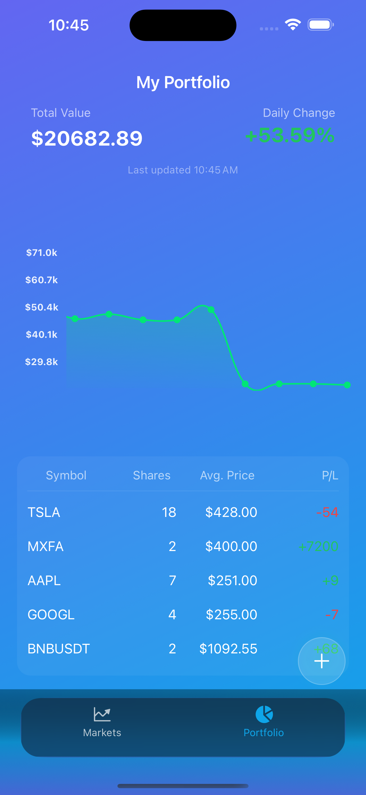

<div align="center">

# 📈 MarketPulse

Live market data for stocks and cryptocurrencies — built with React Native and Expo.

[](https://expo.dev)
[](https://reactnative.dev)
[](https://www.typescriptlang.org/)
[](https://tanstack.com/query)
[](https://github.com/pmndrs/zustand)
[](#-license)

</div>

---

## ✨ Overview

MarketPulse is a sleek cross‑platform mobile app that lets you explore live prices, short‑term trends, and a lightweight personal portfolio for both stocks and cryptocurrencies.

Originally built on the Finnhub API, the data layer is modular and can utilize free alternatives like CoinGecko (crypto) and Yahoo Finance (stocks).

---

## 📚 Table of Contents

- Features
- Tech Stack
- Screenshots
- Getting Started
- Configuration
- Development Notes
- Architecture
- Roadmap
- Contributing
- License
- Author

---

## 🚀 Features

- 🔍 Smart Search
  - Debounced input with cached results across screens.
- 💹 Live Market Feed
  - Real‑time quotes (price, change %, volume) with 60s auto‑refresh via React Query.
- 🪙 Crypto & Stocks Tabs
  - Explore top‑performing equities and major coins side by side.
- 📊 Interactive Charts
  - Smooth line charts, with local mock fallback when API limits are hit.
- 💼 Portfolio Tracking
  - Track holdings, total value, P/L, and performance history.
- 🧠 Optimized Architecture
  - Type‑safe modules, offline caching, and scalable patterns.

---

## 🧩 Tech Stack

| Category | Tools / Libraries |
|---|---|
| Framework | [Expo SDK](https://expo.dev), React Native |
| Language | TypeScript (strict) |
| State Management | [Zustand](https://github.com/pmndrs/zustand) with persist (AsyncStorage) |
| Data Fetching | [@tanstack/react-query](https://tanstack.com/query/latest) |
| Charts | [react-native-gifted-charts](https://github.com/AbelTesfaye/react-native-gifted-charts) |
| Navigation | [Expo Router](https://expo.github.io/router/docs) |
| APIs | [Finnhub](https://finnhub.io) • [CoinGecko](https://www.coingecko.com) • [Yahoo Finance](https://finance.yahoo.com) |
| UI | Custom design system (Colors, Typography, Spacing), Expo Vector Icons, Animated API |

---

## 🖼️ Screenshots





---

## ⚙️ Getting Started

Prerequisites:
- Node.js 18+
- npm or yarn
- Expo CLI (optional, npx works fine)

Installation:

```bash
# 1) Clone the repo
git clone https://github.com/yourusername/marketpulse-app.git
cd marketpulse-app

# 2) Install dependencies
npm install
# or
# yarn

# 3) Create your environment file
cp .env.example .env # if provided, otherwise create it manually (see below)

# 4) Start the app (choose one)
npx expo start            # open Dev Tools and scan the QR code
# npx expo start -c       # clear cache
# npx expo run:ios        # run on iOS simulator (requires Xcode)
# npx expo run:android    # run on Android emulator/device
```

---

## 🔧 Configuration

Environment variables (examples):

```bash
# Finnhub (preferred for stocks)
EXPO_PUBLIC_FINNHUB_API_KEY=xxx-xxx

# Optional: If using other sources, document keys here
# EXPO_PUBLIC_SOME_API_KEY=...
```

Notes:
- CoinGecko endpoints used here typically do not require an API key.
- Yahoo Finance is used through public/unofficial endpoints where possible.
- The app gracefully falls back to mock data when rate limits are reached.

---

## 🧪 Development Notes

- Built entirely with Expo — no custom native modules required.
- React Query provides caching, background refresh, and instant navigation.
- Works offline with persisted state (AsyncStorage via Zustand persist).
- Designed for iOS and Android using Expo Router for file‑based navigation.
- Handles API rate limits with local mock fallback data.

---

## 🏗️ Architecture

High‑level structure:

```
app/                # Expo Router (screens, tabs, routes)
src/
  api/              # React Query hooks, data fetching
  services/         # Helpers, adapters, formatters
  constants/        # Symbols, static lists, theme tokens
  store/            # Zustand stores (persisted)
assets/             # Images, fonts, Lottie, etc.
```

Key patterns:
- Modular data sources (Finnhub, CoinGecko, Yahoo) behind clean hooks.
- Debounced search with cached results.
- React Query keys to scope caching by symbol/source.

---

## 🧭 Roadmap

- [ ] News feed integration (Finnhub / Yahoo)
- [ ] Price alerts
- [ ] Authentication (Firebase / Auth0)
- [ ] RevenueCat subscriptions for premium analytics

---

## 🤝 Contributing

Contributions are welcome! If you’d like to help:
- Open an issue for discussion.
- Fork the repo and create a feature branch.
- Submit a PR with a clear description and screenshots if UI changes are included.

---

## 🪪 License

MIT License © 2025 Boško Jakišić

---

## 👤 Author

**Boško Jakišić** — Frontend & Mobile Engineer

- LinkedIn: https://www.linkedin.com/in/bosko-jaksic-9b746117a/
- GitHub: https://github.com/bosko-front